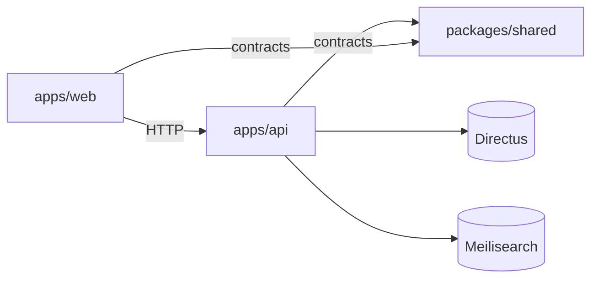
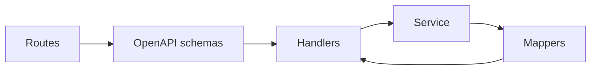
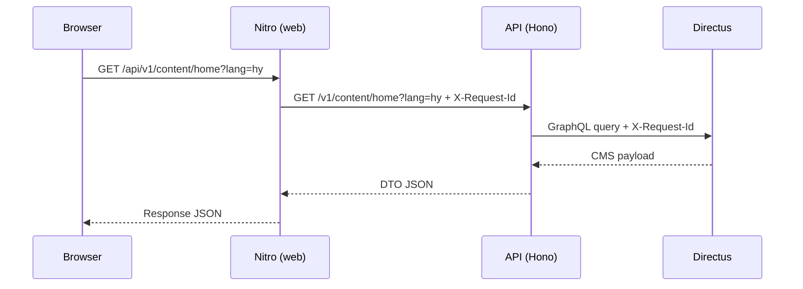
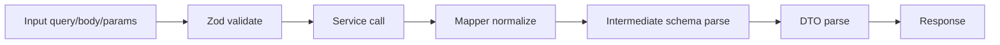
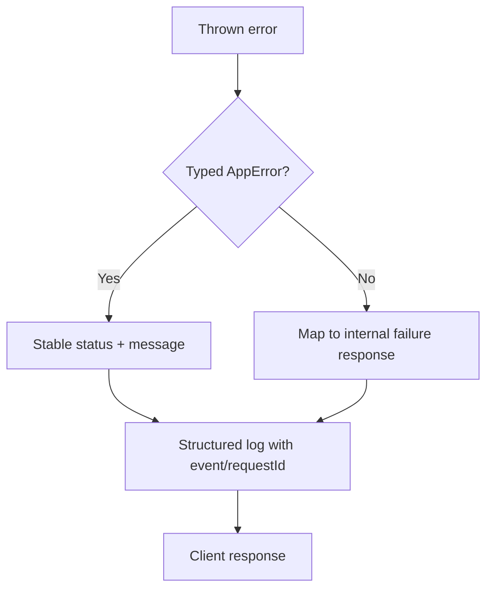
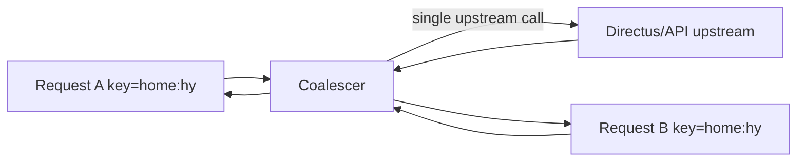
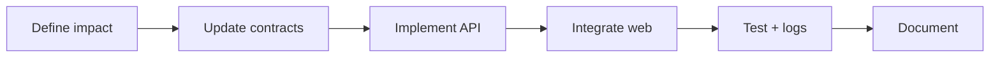
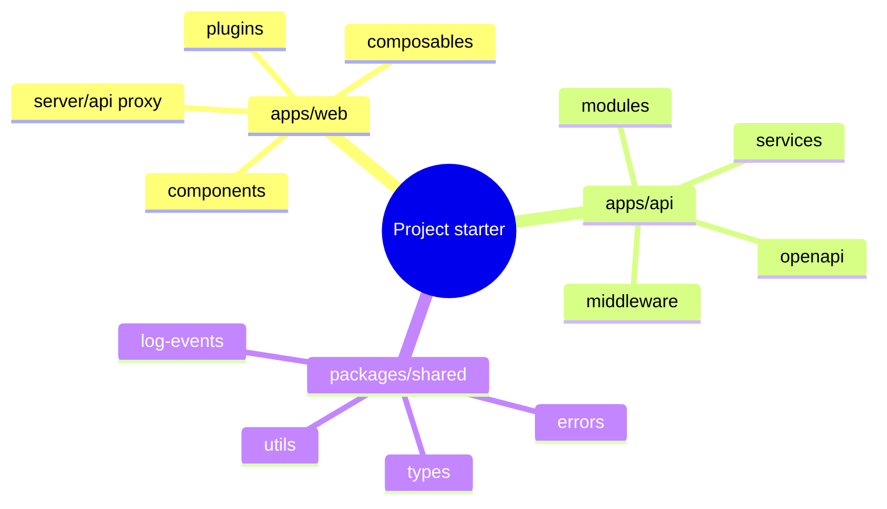

# Architectural Style Guide (Monorepo + Nuxt + Hono)

[Back to README](./README.md)

This guide codifies [NewMoon](https://github.com/InformationSystemsAgency/newmoon)’s current architecture so the team can scale safely and reuse the same structure in future projects with the same stack.

## 1) Architectural Principles

- **Clear boundaries**: each workspace has a single purpose.
- **Contracts first**: shared types/events/errors are owned by shared package.
- **Server-owned integrations**: API owns CMS/search/identity access.
- **Thin transport layers**: routes/handlers/proxies orchestrate; services decide behavior.
- **Observability by default**: every important path is traceable via logs/request IDs.

## 2) Monorepo Boundaries

### Responsibility map



### Workspace rules

- `apps/web`
  - SSR/client rendering, route-level UX.
  - Nitro proxy/cache boundary.
  - No direct browser credentials for CMS/API internals.
- `apps/api`
  - Business logic, integration orchestration, validation, DTO shaping.
  - Owns all external service tokens and connectivity.
- `packages/shared`
  - Cross-app contracts: types, constants, errors, log fields, utility primitives.
  - Public exports only; no consumer deep imports.

## 3) API Module Blueprint

Use one predictable module structure:

```text
modules/feature/
  feature.routes.ts
  feature.openapi.ts
  feature.handlers.ts
  feature.service.ts
  feature.mappers.ts
  feature.validation.ts
  feature.test.ts
```

### Internal flow



### Example split

```ts
// feature.handlers.ts (orchestration only)
export const getFeatureHandler = async (c) => {
  const { id } = c.req.valid('param');
  const result = await getFeatureById(id);
  return c.json(FeatureDTO.parse(result), 200);
};
```

```ts
// feature.service.ts (business logic)
export async function getFeatureById(id: string): Promise<Feature> {
  const raw = await directusClient.query(buildFeatureQuery(id));
  return mapFeature(raw);
}
```

Rule: handlers never own business logic; services never depend on Hono context.

## 4) Web Composition Blueprint

- Components = presentational UI + event emission.
- Composables = reusable interaction/data logic.
- Plugins = global cross-cutting setup (api client, locale, analytics).
- Stores = shared mutable state.
- Nitro routes/middleware = proxy/cache/request context.

### Web layering diagram

```mermaid
flowchart TD
  C[Vue Components] --> CO[Composables]
  CO --> ST[Pinia Stores]
  CO --> PL[Nuxt Plugins]
  PL --> NR[Nitro Routes]
  NR --> API[NewMoon API (github.com/InformationSystemsAgency/newmoon)]
```

Rule: if logic is reused by multiple pages/components, promote it to a composable.

## 5) Data and Network Flow Standards

- Browser uses same-origin `/api/*` routes.
- SSR may call API directly using runtime config.
- API is the single gateway to external systems.
- Always forward `requestId` between hops where possible.

### End-to-end request flow



## 6) Validation and Contract Boundaries

- Use Zod as the only validation mechanism across web/api/shared.
- Validate incoming transport input at API boundary.
- Parse outgoing DTOs before returning response.
- Normalize external payloads in mappers.
- Define and validate intermediate schemas between transformation stages.
- Move reusable cross-app contract types to shared package.

### Example: boundary-safe flow



### Intermediate-state rule of thumb

- Boundary data: `schema.parse(...)` (fail fast, hard contract).
- Mid-pipeline candidate objects: `schema.safeParse(...)` when fallback path exists, otherwise `parse`.
- Final response contract: `DTO.parse(...)` immediately before returning.

## 7) Error Handling Architecture

- API throws typed errors (`AppError` variants) when possible.
- Global API error handler maps unknown errors to safe response shape.
- Integration errors are logged with context, not leaked raw.
- Web client errors go to `/api/client-log`.

### Error pipeline



## 8) Caching and Performance Patterns

- Use coalescing + short TTL on hot API read paths.
- Cache key must include all response-defining dimensions (lang/path/slug/etc.).
- Track `cacheHit` and `coalesced` in logs where available.
- Maintain explicit invalidation mechanisms.

### Coalescing model



## 9) Change Management Rules

For each feature change:

1. Identify workspace impact (`web`, `api`, `shared`).
2. Update contracts first when shared changes are required.
3. Implement API behavior with tests.
4. Integrate in web via composables/plugins.
5. Add/update logs and error mappings.
6. Document env vars, cache keys, and events.

### Delivery flow



## 10) Reuse in New Projects

For future projects with same stack:

- Start with identical workspace split.
- Copy module blueprint and naming conventions.
- Enable strict TypeScript + ESLint before first feature.
- Add shared error/log contract package on day one.
- Build one sample vertical slice (`web -> api -> external integration`) as a reference.

### Starter template map


