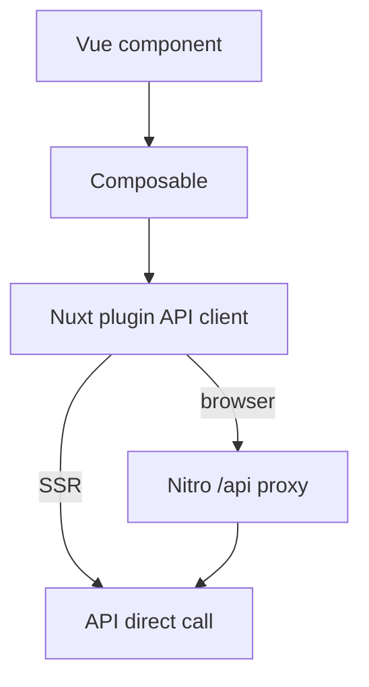

# Coding Style Guide (TypeScript + Nuxt + Hono)

[Back to README](./README.md)

## Quick Start

[`coding-style.md`](./coding-style.md) | [`architecture-style.md`](./architecture-style.md) | [`logging-guide.md`](./logging-guide.md) | [`unit-testing-guide.md`](./unit-testing-guide.md) | [`migrations-guide.md`](./migrations-guide.md) | [`rbac-standards-guide.md`](./rbac-standards-guide.md)

This guide is based on patterns already used in [NewMoon](https://github.com/InformationSystemsAgency/newmoon). It is designed to be strict enough for consistency and practical enough to adopt immediately in this and future projects.

## 1) Baseline Formatting and Linting

- ESLint is the source of truth (`@antfu/eslint-config` + repository rules).
- Formatting defaults:
  - 2 spaces
  - semicolons
  - single quotes
  - max line length near 120
  - Stroustrup brace style
- CI should fail on lint errors. Developers may use `lint:fix` locally.

### Example

```ts
// Good
if (isEnabled)
{
  logger.info({ event: LogEvent.SYSTEM_STARTUP }, 'Startup complete');
}

// Bad
if (isEnabled) logger.info("Startup complete")
```

## 2) TypeScript Rules

- Use strict mode in every workspace.
- Avoid `any`; use `unknown` and narrow.
- Prefer `type` aliases for consistency.
- Exported functions should have explicit return types.
- Parse/validate all external inputs with Zod only.

### Zod-first validation rules

- Use Zod as the single validation mechanism (no parallel Joi/Yup/custom validator stacks).
- Validate at boundaries with `.parse()` / `.safeParse()`:
  - HTTP input (query/params/body)
  - env/config
  - external service payloads
  - persisted/rehydrated cache data
- Keep schemas close to the module (`*.validation.ts`) and compose from shared schemas when reused across apps.
- Prefer schema composition (`.extend`, `.pick`, `.omit`, `.merge`) over duplicated object shapes.

### Intermediate object state validation

- For multi-step transforms, define schemas for each meaningful state and validate between steps.
- Use `safeParse` while branching/recovering; use `parse` when failing fast is correct.
- Use `z.preprocess(...)` for normalization before validation (trim, date parsing, string-to-number, etc.).
- Use `.superRefine(...)` for cross-field invariants that cannot be expressed by type shape alone.

```ts
import { z } from 'zod';

const RawCmsSchema = z.object({
  id: z.string(),
  title: z.string().nullable(),
  published_at: z.string().nullable(),
});

const NormalizedContentSchema = z.object({
  id: z.string(),
  title: z.string().min(1),
  publishedAt: z.coerce.date().nullable(),
});

const ViewModelSchema = z.object({
  id: z.string(),
  title: z.string(),
  isPublished: z.boolean(),
});

export function mapContent(rawInput: unknown) {
  const raw = RawCmsSchema.parse(rawInput); // boundary: external payload

  const normalizedCandidate = {
    id: raw.id,
    title: raw.title ?? '',
    publishedAt: raw.published_at,
  };
  const normalized = NormalizedContentSchema.parse(normalizedCandidate); // intermediate state

  return ViewModelSchema.parse({
    id: normalized.id,
    title: normalized.title,
    isPublished: Boolean(normalized.publishedAt),
  }); // output contract
}
```

### Example: unknown narrowing

```ts
function getErrorMessage(err: unknown): string {
  if (err instanceof Error) return err.message;
  if (typeof err === 'string') return err;
  return 'Unknown error';
}
```

## 3) Naming and File Conventions

- File names: kebab-case.
- API module suffixes:
  - `*.routes.ts`
  - `*.handlers.ts`
  - `*.service.ts`
  - `*.openapi.ts`
  - `*.mappers.ts`
  - `*.validation.ts`
- Web composables: `useXxx.ts`.
- Tests: `*.test.ts` near source.

### Example module tree

```text
modules/content/
  content.routes.ts
  content.openapi.ts
  content.handlers.ts
  content.service.ts
  mappers.ts
  queries/
    content-queries.ts
  content.test.ts
```

## 4) Imports and Boundaries

- Keep imports sorted (auto-fix through lint).
- Use aliases:
  - API/shared: `@/`
  - Web: `~/` and `~~/`
- Never deep-import from sibling workspace internals (`@newmoon/*/*`).
- Import shared contracts only from `@newmoon/shared` top-level exports.

### Example

```ts
// Good
import { AppError, LogEvent } from '@newmoon/shared';

// Bad
import { LogEvent } from '@newmoon/shared/src/constants/log-fields';
```

## 5) API Layer Conventions (Hono + Zod/OpenAPI)

- Route definitions live in `*.openapi.ts` + `*.routes.ts`.
- Handlers must use validated input (`c.req.valid(...)`).
- Handler flow: validate -> service -> DTO parse -> response.
- Business logic stays in services, not handlers.

### Handler flow diagram


### Example: thin handler

```ts
export const getHomeHandler: ApiRouteHandler<typeof getHomeRoute> = async (c) => {
  const { lang } = c.req.valid('query');
  const result = await getHome(lang);
  return c.json(GetHomeResponseDTO.parse(result), 200);
};
```

## 6) Web Layer Conventions (Nuxt + Vue + Pinia)

- Components focus on UI rendering and events.
- Composables/plugins own side-effectful data access.
- Stores are for shared mutable state (auth/session/preferences), not every fetch.
- Keep network behavior explicit:
  - browser -> Nitro proxy (`/api/...`)
  - SSR -> direct API URL

### Data access diagram



### Example: component vs composable

```ts
// Good (component)
const { data, pending, refresh } = useSearch();

// Bad (component with direct complex fetch logic)
const res = await fetch(`/api/v1/search?q=${query.value}`);
```

## 7) Error Handling and Logging

- Do not use ad hoc server `console.log`.
- Use structured logs with `event` and `event_type`.
- Forward `requestId` when moving across boundaries.
- Use `AppError` taxonomy for API error responses.
- Send browser-side failure reports through `/api/client-log`.

### Error/log flow diagram

```mermaid
flowchart LR
  A[Error occurs] --> B{Where?}
  B -->|API| C[Global error handler]
  C --> D[Structured log + stable JSON error]
  B -->|Web client| E[reportClientError]
  E --> F[/api/client-log sink]
```

## 8) Testing Style

- Unit tests next to source (`*.test.ts`).
- Name tests by behavior.
- API:
  - Jest for unit
  - Vitest for integration
- Mock boundaries (Directus/search/network), not internals.

### Example test names

```ts
it('returns null when service is missing', async () => {});
it('throws AppError.badRequest for invalid language', async () => {});
```

## 9) Refactoring Rule (Rule of Three)

- 1st usage: keep it simple.
- 2nd usage: extract a small helper.
- 3rd usage: move to stable shared abstraction.


## 10) Pull Request Standards

Each PR must include:

- What changed and why.
- Architectural impact: none / small / significant.
- Test evidence: unit/integration/manual.
- Logging/error impact: new events, new error types, or no impact.

### PR checklist snippet

```markdown
- [ ] Follows coding-style-guide/coding-style.md
- [ ] Handler/service boundary preserved
- [ ] No deep cross-package imports
- [ ] Tests added or updated
- [ ] Logging/error impact documented
```

## 11) Fast Adoption Defaults (Recommended Order)

1. Enforce ESLint + strict TypeScript in all workspaces.
2. Enforce naming/module file conventions.
3. Enforce thin handlers and service-centric business logic.
4. Enforce shared package public contract imports only.
5. Enforce structured logging and shared error handling.

