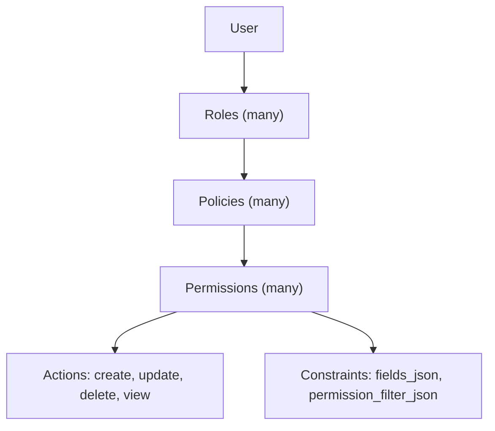
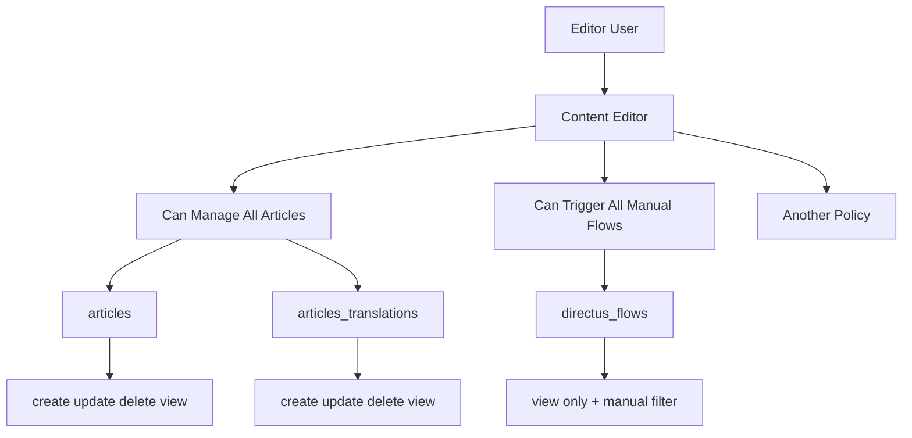

# RBAC Standards Guide

[Back to README](./README.md)

## Quick Start

[`coding-style.md`](./coding-style.md) | [`architecture-style.md`](./architecture-style.md) | [`logging-guide.md`](./logging-guide.md) | [`unit-testing-guide.md`](./unit-testing-guide.md) | [`migrations-guide.md`](./migrations-guide.md) | [`rbac-standards-guide.md`](./rbac-standards-guide.md)

This guide defines how RBAC should be modeled and maintained in any multy user system.

## 1) Core Model

- A **permission** is a collection rule: `collection + actions + optional constraints`.
- A **policy** is a named bundle of permissions.
- A **role** is a named bundle of policy names.
- A **user** can have one or many roles.

Project artifacts implement this as:

- `policies`: canonical policy definitions with collection/action details
- `roles`: role-to-policy mapping using policy names only

Structure




Example




## 2) Naming Rules

Policy names must reflect effective access.

- `Can Manage ...` for CRUD-like control.
- `Can View ...` for read-only access (`view: true`, other actions false).
- `Can Trigger ...` for trigger behavior (for example manual flows).
- `Can Edit Their Own ...` only with self-scope filters.

For field-limited read policies, include a qualifier:

- `Can View All <Domain> (Public Fields)` or
- `Can View All <Domain> (Limited Fields)`

Example:

- `Can View All Directus Files (Public Fields)`

Naming template:

- `Can <Verb> <Scope> <Domain> (<Qualifier>)`

Allowed values by placeholder:

- `<Verb>`: `Manage` | `View` | `Trigger` | `Edit` | `View` | `Remove`
- `<Scope>`: `All` | `Own` | `Manual` | (empty for domain-only names)
- `<Domain>`: `Articles` | `Categories` | `Content Blocks` | `Forms` | `Content Displays` | `Content Types` | `Data Displays` | `Directus Files` | `Menus` | `Pages` | `Services` | `Globals` , etc ...
- `<Qualifier>`: `Public Fields` | `Limited Fields` | `Manual Only` | (omit if not needed)

Concrete examples:

- `Can Manage All Articles`
- `Can View All Directus Files (Public Fields)`
- `Can Trigger All Manual Flows`
- `Can Edit Their Own Profile`

### 2.1) What to Avoid

- Misleading names (`Can Manage ...` for read-only).
- Temporary placeholders in final names (`???`, `tmp`, `new`).
- Duplicate policy definitions with different names.
- Putting collection/action details inside role mappings.
- Broad system permissions without explicit need (`directus_users`, `directus_roles`, `directus_flows`, dashboards).
- Missing constraints for self-scope, trigger scope, or field allowlists.

## 3) Required YAML Shapes

### 3.1 Policy definition shape

Each policy must use:

- `name`
- `collections[]`
  - `collection`
  - `actions.create|update|delete|view` (boolean)
  - optional `constraints`
    - `fields_json` (JSON string)
    - `permission_filter_json` (JSON string)

### 3.2 Role mapping shape

Each role entry must use:

- `role`
- `policy_names[]` (names that exist in `policies`)

### 3.3 YAML examples

Policy definition example

```yaml
- name: "Can Trigger All Manual Flows"
  collections:
    - collection: directus_flows
      actions:
        create: false
        update: false
        delete: false
        view: true
      constraints:
        fields_json: '["id", "status", "name", "icon", "color", "options", "trigger"]'
        permission_filter_json: '{"trigger": {"_eq": "manual"}}'
```

Role mapping example

```yaml
- role: "Website API"
  policy_names:
    - "Can Trigger All Manual Flows"
    - "Can View All Articles"
    - "Can View All Content Displays"
    - "Can View All Directus Files"
```

Example from real project: [`docs/roles/policies-and-roles.yaml`](assets/policies-and-roles.yaml).

## 4) Required Artifacts

Maintain and keep synchronized:

Required

- `docs/roles/policies-and-roles.yaml` (merged policies + roles mapping)

Optional

- `docs/roles/content-editor-role-policies.yaml`
- `docs/roles/website-api-role-policies.yaml`
- `docs/roles/public-role-policies.yaml`

## 5) Change Workflow

1. Update per-role policy YAML files.
2. Ensure policy names match actual access level.
3. Merge/dedupe into `policies-and-roles.yaml`.
4. Rebuild/verify `roles` mapping (names only).
5. Validate:
  - no missing policies
  - no duplicates by full content
  - each role policy name resolves to existing policy

## 6) PR Checklist

- Names match effective permissions.
- Read-only policies use `Can View ...`.
- Field-limited reads include `(Public Fields)` or `(Limited Fields)`.
- No duplicate policies by full content.
- `roles` section lists names only.
- Constraints are present where needed.
- No accidental sensitive system access.

## 7) Tooling

RBAC tooling (scripts and helpers for working with policies and roles) currently lives in the Newmoon repository; **this location is temporary** and may move later.

[InformationSystemsAgency/newmoon — `tools/rbac` (develop)](https://github.com/InformationSystemsAgency/newmoon/tree/develop/tools/rbac)
